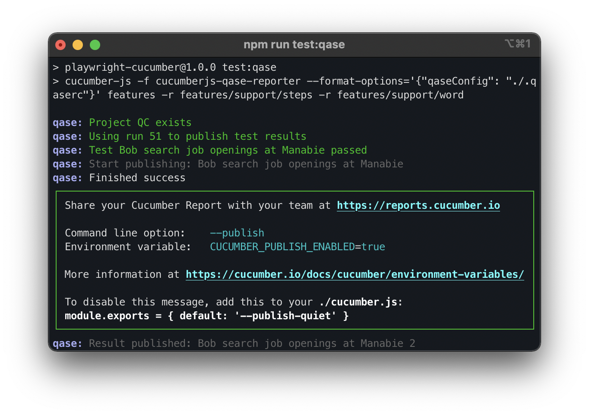

Before publication in Qase TMS must be completed `.qaserc`

The instructions are also available here [qase-cucumber](https://github.com/qase-tms/qase-javascript/tree/master/qase-cucumberjs)

To execute a test case of the cucumber-qase-reporter handler using playwright, just run the command:

```
npm i && npm run build
```
then
```
npm run test        //without publishing to Qase TMS
```
or
```
npm run test:qase       //publishing results to Qase TMS
```
